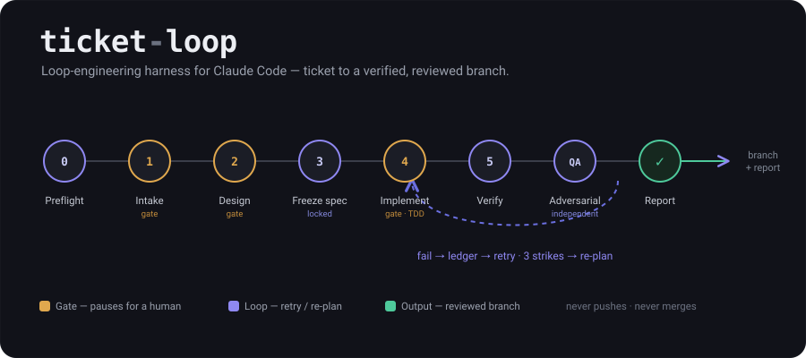
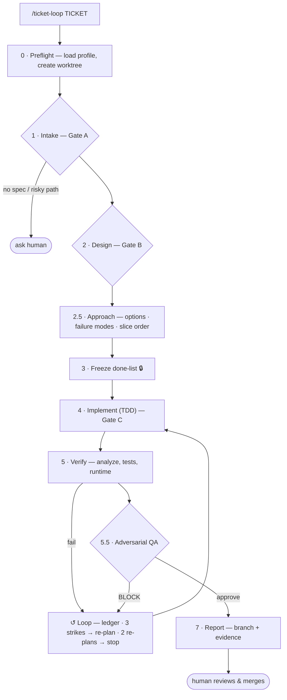

# ticket-loop — a loop-engineering harness for Claude Code



Turn a ticket into a **verified, spec-bound** change with minimal babysitting. You give it a
ticket; it studies the ticket, pulls the referenced design (optional), writes a
machine-checkable "done" list and **freezes** it, implements against it with TDD in an
isolated git worktree, verifies (analyzer + tests + optional runtime), runs a **fresh-context
adversarial QA** pass, self-corrects on failure with an attempt ledger and circuit breakers,
and hands you a branch + an evidence report. It never pushes or merges — humans do that.

This is "loop engineering": you stop prompting the agent turn-by-turn and instead build the
loop that prompts it for you — with a frozen definition of done, informative feedback, a
memory of what already failed, an independent judge, and a budget.

## How it works



- **Gates** pause for a human (no spec, risky path, design conflict) — these are the
  orchestrator's discipline, not a fence; see [what's mechanical](#how-the-loop-stays-honest).
- **The loop** records every failure in a ledger and never repeats a dead approach; 3 strikes force a re-plan, 2 failed re-plans stop and escalate, a 25-dispatch budget caps the worst case (the dispatch and re-plan caps are enforced by hooks, at the tool call).
- **Adversarial QA** is a fresh-context judge that reads the frozen spec and the diff, but is blind to the implementer's reasoning.
- The loop **never pushes or merges** — a hook refuses `git push`, `merge`, `rebase` and
  `gh pr create|merge` for the duration of a run, so this is a fence rather than a promise.
  Outside a run it does not police your repo.
- Every counter, gate, check result and verdict lands in a **sealed receipt chain** outside the
  run directory, and each receipt has to carry the artifact the stage produced — so the closing
  report's integrity section is a machine check of *what was recorded*. Whether that check gets
  run and pasted honestly is still the loop's own word; see
  [what's mechanical](#how-the-loop-stays-honest).

## What's in here

Packaged as a Claude Code **plugin** (installable — see [INSTALL.md](INSTALL.md)):

```
.claude-plugin/marketplace.json      # makes the repo /plugin-installable
plugins/ticket-loop/
  .claude-plugin/plugin.json         # plugin manifest
  hooks/
    hooks.json                       # registers the hooks (uses ${CLAUDE_PLUGIN_ROOT})
    hook_lib.js                      #   shared: profile resolution + safe command execution
    guard_policy.js                  #   the write policy (pure functions, unit-tested)
    post_edit.js                     #   PostToolUse: format + analyze each edit (config-driven)
    freeze_guard.js                  #   PreToolUse: default-deny writes to frozen + control-plane files
    dispatch_guard.js                #   PreToolUse(Task): the dispatch budget, enforced at the tool call
    stop_gate.js                     #   Stop: verify main repo + every worktree, vs the BRANCH POINT
  skills/ticket-loop/
    SKILL.md                         # the orchestration playbook (stages 0–7) — STACK-AGNOSTIC
    report-template.md               # the evidence report's schema
    prompts/                         # implementer / fixer / adversarial-QA subagent prompts
    scripts/
      load_config.js                 # zero-dep profile resolver
      chain.js                       # HMAC-sealed receipt chain (lives OUTSIDE the run dir)
      validate_done.js               # done-list + approach contract validator → validation receipt
      freeze_done.js                 # draft → frozen done.md + done.approved.md (receipt-gated)
      ledger.js                      # budget, stage receipts, check history, integrity report
      memory.js                      # cross-run lessons store
    config.example.json              # profiles for Flutter / Python / Go — copy ONE
settings.example.json                # manual hook registration (non-plugin installs)
tests/                               # node:test suite for the scripts + hooks (node tests/run.js)
```

## Stack-agnostic by design

The **skill** knows nothing about any language. Everything discipline-specific lives in a
per-repo profile at `.agents/ticket-loop.config.json`:

| Field | What it drives |
|---|---|
| `ticketSource` | `jira` / `github` / `gitlab` / `trello` / `manual` — where the ticket comes from (`manual` = you paste it or pass it as the arg; no board needed) |
| `designSource` | `none` / `figma` / `openapi` — gates the design stage |
| `verify.analyze` / `verify.test` / `verify.pubGet` / `verify.codegen` | the commands the loop runs |
| `riskPaths` | hard-stop paths that require human clearance (auth, API contracts, migrations, deps) |
| `worktreePrefix` | where the isolated worktree is created |
| `buildResolverAgent` | which subagent fixes build/compile failures |
| `memoryFile` | cross-run lessons file the loop reads at the start and appends to at the end (`null` disables) |
| `models` | model per dispatch role (`survey` / `implementer` / `fixer` / `qa`), each defaulting to `inherit` = the session model. Opt-in cost tiering: downgrade `survey` first (read-only, caught downstream), `implementer` second (verification + QA backstop it), `qa` last or never — it is the backstop. The model used lands in the ledger label and report |
| `qaScope.smallDiffLines` | a committed diff at or under this many changed lines (default 60) touching no `riskPaths` gets a *focused* QA read (changed files + their consumers + the contract) instead of a codebase sweep; `0` = always sweep. Scope never shrinks verdict authority, and risk-path touches always get the full read |
| `hooks.postEdit` / `hooks.stopGate` | what the plugin's hooks format/analyze on each edit, and which tests must be green before a "done" claim — per stack, from the same profile. `stopGate` also takes `baseRef` (the branch point committed slices are diffed against), `worktrees` (`all`/`ticket`/`cwd`), and `requireMatchingTest` (block source changes no test covers) |
| `attribution.commitTrailer` | repo policy on AI attribution: a trailer string appended to every worktree commit (for teams that require disclosure), or `null` (default) for clean commits with none. The implementer is also barred from AI-style narration comments — new code must be indistinguishable from the code around it |

Copy one profile out of `config.example.json` to `.agents/ticket-loop.config.json` and edit.
With no config, the loop degrades honestly (asks / logic-only) — it never silently assumes a stack.

> **Note on the hooks:** `post_edit` and `stop_gate` are **config-driven, not stack-coded** —
> they read the same profile and run whatever `hooks.postEdit` / `hooks.stopGate` commands it
> names (the Flutter profile shows the full shape; Python/Go profiles included). With no config
> they are inert — they never guess a stack — **except** that the stop gate refuses to pass a
> "done" claim while a run is active and its config is missing or unparsable, since that is
> indistinguishable from disarming it. `freeze_guard` and `dispatch_guard` need no profile and
> work everywhere. The stop gate checks the main repo AND every worktree, against each tree's
> merge-base rather than its working tree.

> ⚠️ **The profile is executed, so it is as trusted as code.** The strings in `verify.*` and
> `hooks.*` are run by hooks, and hooks do not prompt for permission. Installing this plugin
> globally means any repo you open that ships a `.agents/ticket-loop.config.json` can run
> commands on your machine at every file edit and every Stop. Review that file before opening
> an untrusted repo — see the Security section in [INSTALL.md](INSTALL.md).

## Install

**As a plugin (recommended — one command, available in every project):**

```
/plugin marketplace add SyedMuhammadRehan/ticket-loop-harness
/plugin install ticket-loop
```

Then, per repo, add a profile and run:

```
# copy a profile from plugins/ticket-loop/skills/ticket-loop/config.example.json
#   into  .agents/ticket-loop.config.json  and edit for your stack
/ticket-loop <TICKET-ID> --dry-run    # reads + plans, no code
/ticket-loop <TICKET-ID>              # full run
```

Full steps, the manual (non-plugin) install, and the one thing to test first are in
[INSTALL.md](INSTALL.md).

## Requirements

- Claude Code
- Node ≥ 18 (hooks + scripts, zero npm dependencies)
- Your stack's toolchain on PATH
- Optional MCP servers: a ticket source (e.g. Jira), a design source (e.g. Figma), and a
  browser driver (e.g. Playwright) for runtime checks. Each degrades gracefully if absent.

## Cross-run memory

The loop doesn't start cold every time. `memoryFile` points at a committed markdown store with
two tiers:

- **Lessons (curated)** — human-maintained, high trust. The loop reads these and feeds relevant
  ones into its subagents (known-flaky tests, fixes for recurring errors, repo conventions).
- **Pending (auto-captured)** — the loop appends here at the end of a run (a flake it hit, a
  non-obvious fix that worked). You periodically promote the good ones into Lessons and prune.

This is the difference between an agent that repeats the same mistakes and one that gets better
with every ticket. Managed by `scripts/memory.js` (zero-dep).

## How the loop stays honest

The honest version of this section names what is mechanical and what isn't, because a
guardrail you *believe* in but that is only a sentence in a prompt is worse than no guardrail.

### Mechanical — the orchestrator cannot get past these by choosing not to cooperate

- **Sealed receipt chain** — every counter, stage completion, check result and QA verdict is
  an HMAC-sealed, hash-linked record in `<gitdir>/ticket-loop/<TICKET>/`, **outside** the run
  directory. `ledger.js verify` recomputes every seal and link, and re-hashes the frozen
  contract and the profile against what was sealed. `budget.json` in the run dir is a
  human-readable *mirror*: editing it changes nothing and shows up as drift. A `head.json`
  anchor records the expected record count and last seal, because seals and prev-links cannot
  see records dropped off the **end** of the chain — and dropping the tail needs no key.
- **A receipt costs the artifact it claims** — `ledger.js gate` refuses a stage whose artifact
  is not among the sealed evidence (`intake` needs `ticket-brief.md`, `report` needs
  `report.md`, …), and stages whose product is another record are bound to it: `verify` needs a
  `check`, `qa` needs a `verdict`. A verdict must seal the frozen contract and follow a dispatch
  recorded after the freeze. Before this, all ten gates plus an `APPROVE` were eleven free
  commands over a run in which nothing happened.
- **A result records how it was reached** — `ledger.js check` requires `--by
  command|observed|human|asserted` and seals it with the result, because PASS/FAIL/SKIPPED
  cannot tell a suite that ran from source that was read. `asserted` is refused for a PASS: if
  nothing was run, watched, or looked at, the honest record is SKIPPED. A `(manual)` criterion
  can be passed only `--by human`, checked against the kind in the *frozen contract* rather than
  a second list that could disagree with it. `ledger.js cost` reports the breakdown, so a report
  can say "eight by command, one by a person" instead of nine indistinguishable passes.
- **The chosen design must name what it reuses** — `validate_done.js` requires the `## Chosen`
  option to carry `| reuses: <existing code>`, or `reuses: none (<what you searched for>)` with a
  reason substantial enough to be a finding. The implementer's rung 2 — "is it already in this
  codebase?" — gets answered while it is still a sentence, instead of at review time when a new
  helper is already written.
- **An edit to a sealed document costs a receipt** — several artifacts keep growing after their
  gate by design (`ledger.md` gains an attempt per dispatch, `approach.md` gains `## Revisions`),
  so `ledger.js revise <file> --reason "…"` records the change and `verify` reports it as a
  revision rather than tampering. The receipt covers the one content hash it named — the next
  edit needs its own — and `done.md`, `*.approved.md`, `budget.json`, `clearances.json` and the
  profile are refused outright, because a contract that can be restated after the freeze is not
  a contract. Without this the strict check made a run that followed the playbook exactly
  accuse itself, and an integrity line nobody believes is worth less than none.
- **Preflight validates the harness, not just the run** — `load_config.js` reports a missing or
  unusable `hooks.stopGate` block at Stage 0, and the playbook stops there. Once a run is active
  the stop gate refuses every turn-end without that block *and* `freeze_guard` freezes the
  profile, so the only exit is archiving the run: a precondition the harness needs has to be
  checked where fixing it is still free.
- **A run ends on a sealed close, not on a file** — `ledger.js close` writes `closed.json` and
  refuses without a `report` receipt; that marker, not the presence of `report.md`, is what
  releases the dispatch budget and the control-plane freeze. The old signal meant the loop's own
  deliverable was the off switch for every gate.
- **What each dispatch was handed is recorded** — the filled prompt is visible only to
  `dispatch_guard`, which measures it and seals the size with the dispatch receipt, so
  `ledger.js cost` reports total/max/average prompt size and how many exceeded
  `dispatchPolicy.promptBudgetChars`. A dispatch recorded by the script rather than the hook
  leaves the size null instead of guessing. This measures the largest recurring cost in a run;
  it does not cap it — see "Yours to uphold".
- **A closed run stays closed** — every mutating `ledger.js` command refuses once `closed.json`
  exists, and `verify` compares the chain against the record count and last seal the close
  marker captured. Closing releases the dispatch budget and the control-plane freeze on the
  strength of the receipts as they stood; without this a run could keep collecting them
  afterwards and still verify intact, with the report describing a different run than the one
  the gates were lifted for.
- **Dispatch budget, enforced at the dispatch** — `dispatch_guard.js` is a `PreToolUse` hook on
  the subagent tool. It counts every subagent call and refuses the tool at the cap. Not calling
  `ledger.js` buys no extra tries. 2-re-plan circuit breaker likewise.
- **The work stays yours to publish** — while a run is active the guard refuses `git push`,
  `git merge`, `git rebase` and `gh pr create|merge`. The loop commits each green slice inside
  its own worktree and stops there; nothing reaches a remote or your default branch. Once the
  run is closed the fence lifts, because then it is just your repo again.
- **Frozen done-list** — `freeze_guard.js` is **default-deny** over the protected namespace: a
  command that references `done.md` / `*.approved.md` / the chain is refused unless it is
  read-only or an exact sanctioned harness invocation. That covers the routes a verb blocklist
  misses — `python -c`, `node -e`, `[System.IO.File]::WriteAllText`, `cd <run> && sed -i`,
  `$(…)` inside an otherwise-sanctioned command, `-EncodedCommand`, `git clean -fdx`.
- **The contract can't be *trivially* self-certified** — `validate_done.js` requires at least one
  `(test)`/`(runtime)` criterion, unique ids, no pre-ticked boxes, and `run:` commands that name
  the profile's real verify binary. `freeze_done.js` then refuses any draft that wasn't
  validated, or that changed after it was. **Known limit:** the `run:` check compares only the
  binary name, so a neutered invocation of the *right* binary passes —
  `run: {verify.test} --grep no-such-test`, or `run: true` for an `(analyzer)` criterion when
  `verify.analyze` is null. It catches the wrong tool, not a no-op call of the right one; the QA
  judge is what is supposed to catch the rest, and that is judgement, not a check.
- **The gates can't be disarmed mid-run** — while a run is active, the profile, the hook
  sources and the hook state are read-only, and the stop gate **blocks** rather than going
  inert if the profile goes missing or unparsable. The profile's hash is sealed at Stage 0.
- **The gate costs nothing outside a run** — a repo keeps its profile permanently, so the stop
  gate returns without running anything unless a ticket run is active. Otherwise every ordinary
  session in that repo would verify its whole suite at each turn-end (with `npx next build` as
  `verify.test`, minutes per turn) — the opposite of "a broken install must not break unrelated
  projects".
- **A "done" claim is checked against the branch point** — `stop_gate.js` compares each tree
  (main repo *and* every worktree, including detached-HEAD and non-`ticket/*` branches) against
  its merge-base, not against `git status`. This is the fix for the gate's worst old bug: the
  loop commits after every green slice, so a working-tree check saw a clean tree and passed
  without running a single test. When there is no branch point to diff against — no base ref, or
  HEAD *is* the base because the session is committing straight to the default branch — it runs
  the full verification instead of passing on an empty diff, and every path that ends in "not
  verified" says so on stderr so Stage 7 has something to disclose.
- **Approach contract isn't opt-out** — if the survey produced a `codebase-map.md`, the change
  was judged feature-sized and `approach.md` becomes *mandatory*; deleting it to skip the
  failure-mode contract no longer works. Every failure mode must map to a criterion or an
  out-of-scope with a reason of real substance, and they can't *all* be waived.
- **"Minimally" is a procedure, not an adjective** — the implementer climbs a ladder before
  writing anything (does this need to exist → is it already in the codebase → stdlib →
  platform feature → an already-installed dependency → one line → only then new code) and
  reports the rung it stopped at. The approach stage must offer the cheapest option that
  could work, so "build it new" has to win on merit. The QA judge carries the matching
  check and quotes a shorter alternative when it finds one. Validation, error handling,
  security, accessibility and the criteria's tests are never on the chopping block —
  cutting those isn't minimalism, it's a bug. (Ladder adapted from
  [ponytail](https://github.com/dietrichgebert/ponytail).)
- **`riskPaths` is a fence, not a note** — while a run is active, `freeze_guard` matches every
  edit target against the profile's `riskPaths` globs and **denies** it until a clearance for
  that area exists. Clearances are per-glob (clearing `lib/ui/auth/**` does not open
  `**/migrations/**`), are recorded in the sealed chain with a mandatory reason via
  `ledger.js clear`, and are read by the hook from a write-protected mirror — a malformed
  mirror denies rather than opening everything. Outside a run the hook ignores `riskPaths`
  entirely, so ordinary development is never policed.
- **Bounded, in-place work** — subagents edit in chunks rather than rewriting a file to
  change part of it, prefer the native file tools over `cat`/`grep`/`sed`/`echo >`, and
  return a bounded summary with no file contents restated. A full-file rewrite for a
  four-line change costs the run far more than the change is worth, buries the diff the
  judge has to read, and the judge now flags it. Long artifacts live in the run dir, not in
  a subagent's reply — anything repeated in chat is paid for on every later turn.

### Yours to uphold — and visible in the report if you don't

- **Whether a human was really asked.** `riskPaths` *are* now a fence — see below — but the
  clearance that opens one is recorded by the loop, so nothing proves a human was consulted
  before it was recorded. What you get is that clearing an area is a deliberate, separate,
  *sealed* act naming the area and the reason, and it appears in the report; skipping the
  conversation is visible after the fact rather than invisible.
- **GATE B (design conflict).** Judgement — no code can tell you a Figma node contradicts the
  ticket text.
- **Whether `verify.test` can actually fail.** Preflight warns about the shapes decidable from
  the command string: a tail that discards the exit code (`|| true`, a terminal `; exit 0`) and
  an inline one-liner standing in for the suite (`node -e "process.exit(0)"`). It says nothing
  about the two shapes that need the repo read: a filter matching no test, and an entrypoint
  that exits 0 early under an environment variable. Deciding either means reconstructing the
  runner's discovery and naming, or evaluating a guard and ruling out every failing path. Six
  adversarial rounds each found one more spelling past whatever rule bounded those two; the
  honest answer needs the command run, which a profile resolver must not do. So a silent
  preflight means "no *recognised* shape", not "your suite can fail". That one is still yours
  to know.
- **Dispatching only what is worth dispatching.** A subagent costs its whole prompt before it
  works, so `dispatchPolicy.minSliceLines` says do small and test-only slices inline. Nothing
  can enforce it: at dispatch time no one knows how large the change will turn out. The prompt
  templates are ordered so their stable text caches and the per-dispatch fills come last, and
  a test holds that ordering — but whether you fill them with excerpts or paste whole files is
  yours. Both show up in `ledger.js cost` afterwards (lines per dispatch, prompt sizes), which
  is the difference between a cost you can see and one you cannot.
- **Whether a revision reason is true.** `ledger.js revise` proves that a sealed document
  changed, when, and to exactly what content — not that the stated reason is the real one. What
  it buys is that every post-gate edit is a deliberate, separate, sealed act carrying a reason
  into the report, instead of a silent rewrite. Read the reasons; they are the loop's own words.
- **Whether a dispatch outcome is honest.** The dispatch *count* is mechanical (`dispatch_guard`
  counts the tool call). The `died` outcome is the orchestrator's own report: a dispatch that
  produced nothing can be left unrecorded, which understates the waste rather than the spend.
  The budget it consumed is still counted either way.
- **Naming a protected file as data is denied like touching it.** The write policy cannot tell
  a target from a mention, and deliberately does not try: quotes are stripped precisely so a
  quoted real target is still caught. So while a run is active, a command that merely *contains*
  a protected filename and is not read-only is refused — a commit message about `done.md`, a
  heredoc writing a fixture that mentions an approved artifact, a probe script echoing one.
  Fixing this by trusting quoted content would reopen the bypass the stripping closes, so the
  friction is intentional. Work around it rather than weakening the rule: pass the text via
  `git commit -F <file>`, write the file with an editor instead of a shell redirect, or split
  the command so the statement naming the path is read-only. Costs a developer of the harness
  more than a user of it.
- **Which model a dispatch actually ran on.** The profile's `models` block and the
  diff-scaled QA scope are playbook-followed: the orchestrator is instructed to pass the
  configured model and scope, and to say so in the ledger label — but no hook can verify
  which model a subagent ran on. What you get is the same as elsewhere: the choice is
  recorded and sealed, so a cheaper-than-configured run is visible in the report, not
  provably impossible.
- **The strike count** per failure class (3 → re-plan) is orchestrator bookkeeping. Only the
  dispatch and re-plan caps are counted mechanically.
- **Honest failure classification.** `FLAKY_VERIFIER` now requires an alternating history in the
  sealed check record, and `GOLDEN_UPDATE_REQUIRED` must be reported as *not verified* — but
  choosing the right class in the first place is judgement.
- **Keeping `done-additions.md` additive.** It has to stay writable to be useful, so a
  weakening addition is caught by review, not by code: the QA judge reads both the frozen
  contract and the additions from disk and BLOCKs contradictions.

### Adversarial QA

A fresh-context judge whose independence is from the **implementer's reasoning** — it is barred
from `ledger.md`, attempt history and implementer output. It reads the frozen contract, the
additions and the brief **from disk itself**, rather than through the orchestrator's summary of
them: a judge whose only view of the contract comes from the party under review can't detect a
weakened one. It records its own verdict via `ledger.js verdict`, sealing the contract files it
actually read, and its default posture is to reject.

### Residual risk, stated plainly

An agent with shell access is not sandboxed by any of this. It could read the chain key and
forge receipts; it could reach a protected file through a tool surface these hooks don't see.
What the design buys is that every such route is now a deliberate, unusual act that the guard
denies by default and that `ledger.js verify` reports afterwards. **Integrity here is
tamper-evident, not tamper-proof** — the point is that a lazy or drifting loop can no longer
produce a clean-looking report by accident, and a determined one leaves marks.

Named limits, so they are not mistaken for guarantees:

- **The write policy denies on the path as *written*.** A command that never spells a protected
  path is not evaluated at all, so string concatenation, a glob, or a variable reaches files a
  literal path would not. It is a good filter on lazy behaviour, not a sandbox.
- **`verify` does not prove the judge was independent.** It proves the verdict sealed the frozen
  contract and followed a dispatch; when that dispatch was not counted by the hook it says the
  independence is unverified. Process identity is not available to it.
- **Timestamps are not checked.** `at` is whatever the writer put there; there is no monotonicity
  check, so a receipt's clock is not evidence.
- **Running the integrity check is still the loop's job.** Nothing forces `ledger.js verify` to
  run, or forces its real output into `report.md`. Read the Integrity section knowing that.
- **Concurrent writes to the chain are not serialized.** Two dispatches racing can lose records
  or break the chain — it fails loudly (exit 4) rather than miscounting silently, but a run that
  dispatches subagents in parallel can end up unreportable.

The whole enforcement layer is covered by a test suite (`node tests/run.js`, 150+ tests), which
includes the full corpus of bypasses found while attacking it, as regression cases — including a
known-answer test for the seal, because the suite once passed in full with the HMAC replaced by
an unkeyed hash.

## Worked example

A small, realistic run against a Flutter app with the `flutter` profile. Ticket **PROJ-128:
"Profile screen shows a friendly error state when the API fails (404 / 500), not a raw
exception."** The ticket has a Figma link for the error state.

**The stack here is illustrative, not structural.** Flutter plus Figma exercises every stage at
once: analyzer, test runner, design tokens, runtime checks. Every command below is read from
`verify.*` in the profile and none is hardcoded in the plugin. This repo runs the loop on itself
under a `node` profile; Python and Go profiles ship in `config.example.json`.

You run:

```
/ticket-loop PROJ-128
```

**Stage 0–1 (preflight + intake).** It loads the profile (`stack: flutter`,
`designSource: figma`), creates the worktree `../ticket-PROJ-128` on branch
`ticket/PROJ-128`, runs `flutter pub get` + codegen, fetches the ticket, and writes
`ticket-brief.md`. The RISK SCAN flags that the change touches an API-contract dir listed in
`riskPaths` — so **GATE A fires** and it asks once:

```
GATE A — PROJ-128 touches a risk-tier path (lib/data/services/**, from riskPaths).
Proceed? Acceptance criteria found (3), Figma link found. Clear this path? [y/n]
```

You clear it. (If there had been *no* acceptance criteria and *no* design link, it would have
stopped and asked for scope instead of guessing — that refusal is the point.)

**Stage 2–3 (design + approach + frozen done-list).** It pulls the Figma node's exact
values into `design-spec.md`. The ticket is feature-sized (repository + screen), so it
records the design decision in `approach.md` before writing the contract:

```markdown
## Options
- A: map DioException → typed ProfileError in the repository — UI stays transport-blind
- B: catch DioException in the widget — fewer files, but couples UI to dio and every
  future caller re-implements the mapping
## Chosen
- A: error semantics belong at the data boundary; B leaks transport details upward
## Failure modes
- API 404 vs 500 need distinct messages | covered-by: C1
- retry storms if the user hammers the button | covered-by: out-of-scope (rate-limit ticket)
## Slice order
- 1st: C1 repository mapping — if typed errors can't cross this boundary cleanly, A is wrong
```

Then it writes and validates `done.md` (the validator mechanically checks every failure
mode above is covered), then **freezes** it:

```markdown
# Done — PROJ-128
## Criteria
- [ ] C1 (test): repository maps 404/500 DioException → typed ProfileError | run: flutter test test/data/profile_repository_test.dart
- [ ] C2 (test): ProfileScreen renders ErrorView (friendly text + retry) on failure | run: flutter test test/ui/profile_screen_test.dart
- [ ] C3 (token): error title uses #B00020 at 16px | run: flutter test test/ui/profile_error_tokens_test.dart
- [ ] C4 (analyzer): zero analyzer errors | run: dart analyze
## Tokens
- errorTitleColor: #B00020 (source: design-spec.md#colors)
## Out of scope
- offline/no-network banner (separate ticket)
```

`--dry-run` would stop here — brief, design-spec, frozen done-list, no code.

**Stage 4–6 (implement + verify + loop).** One implementer slice per criterion, TDD. C3
fails the first time — the widget used the wrong token. The ledger records it and the fixer is
dispatched with the exact mismatch:

```markdown
### Attempt 1 — TOKEN — C3
- hypothesis: error title rendered with theme.error (#D32F2F), not the spec token
- change: (none yet — first observation)
- result: FAIL — expected Color(0xFFB00020), actual Color(0xFFD32F2F)
- forbidden-now: relying on theme.error for the error title
```

Second attempt passes. Each green slice commits inside the worktree. Stage 5 then runs the
full done-list: `dart analyze` clean, `flutter test --exclude-tags golden` green, token test
green, and a runtime check (Playwright) confirms the error state renders with no overflow at
1440px and 768px.

**Stage 5.5–7 (adversarial QA + report).** A fresh-context judge — which sees the contract and
the diff but *not* the implementer's reasoning — returns:

```
VERDICT: APPROVE WITH COMMENTS
FINDINGS:
- [COMMENT] test/data/profile_repository_test.dart — 500 case asserts the message string
  but not that `detail` from the backend is surfaced; consider asserting the mapped detail.
```

The run completes and writes `report.md`:

```markdown
# Ticket Loop Report — PROJ-128
Status: COMPLETE
Branch: ticket/PROJ-128 (worktree ../ticket-PROJ-128) — merge/push are manual
Duration: 11m 42s | Dispatches: 6/25 | Re-plans: 0/2

## Integrity
{ "records": 19, "intact": true, "problems": [] }
Stage receipts: intake, survey, design, approach, validate, freeze, verify, qa
Restarts: none

## Criteria evidence
| # | criterion | result | evidence |
|---|---|---|---|
| C1 | 404/500 → typed error | PASS | profile_repository_test.dart 5/5 |
| C2 | ErrorView renders | PASS | profile_screen_test.dart 3/3 |
| C3 | error token #B00020/16px | PASS | check history: FAIL → PASS (attempt 2) |
| C4 | analyzer clean | PASS | dart analyze: No issues found |

## QA verdict
APPROVE WITH COMMENTS — 1 comment (500 detail assertion) recorded above.
Recorded: seq 18. Judged inputs: done.approved.md, done-additions.md (hashes sealed).

## Known gaps / follow-ups
- QA comment on the 500-detail assertion, left for your call.

## Not verified
- Golden tests never run (excluded from verify.test) — visual regressions are unchecked here.
```

You review the branch, address the QA comment if you agree, and merge. The loop never pushed,
never merged, never touched `main`.

## Prior art

- [ponytail](https://github.com/dietrichgebert/ponytail) (MIT) — the code-minimization
  decision ladder the implementer, fixer and QA prompts now use. Reimplemented here in this
  repo's own words and wired into the loop's stages; the idea is theirs.

## License

MIT — see [LICENSE](LICENSE).

---

*Built as a personal project. Not affiliated with any employer. Contributions welcome.*
