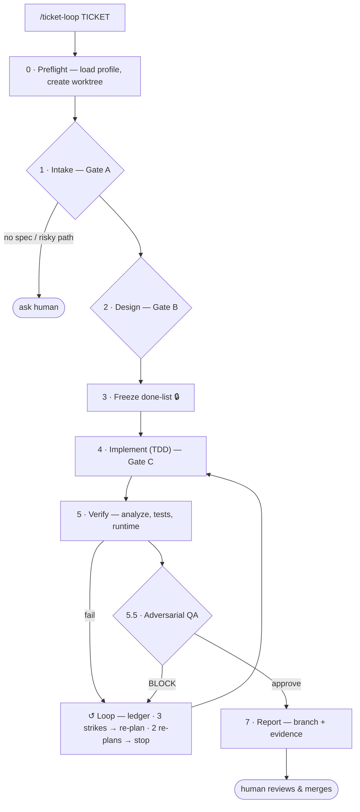

# ticket-loop — a loop-engineering harness for Claude Code


Turn a ticket into a **verified, spec-bound** change with minimal babysitting. You give it a
ticket; it studies the ticket, pulls the referenced design (optional), writes a
machine-checkable "done" list and **freezes** it, implements against it with TDD in an
isolated git worktree, verifies (analyzer + tests + optional runtime), runs a **fresh-context
adversarial QA** pass, self-corrects on failure with an attempt ledger and circuit breakers,
and hands you a branch + an evidence report. It never pushes or merges — humans do that.

This is "loop engineering": you stop prompting the agent turn-by-turn and instead build the
loop that prompts it for you — with a frozen definition of done, informative feedback, a
memory of what already failed, an independent judge, and a budget.

## How it works



- **Gates** pause for a human (no spec, risky path, design conflict).
- **The loop** records every failure in a ledger and never repeats a dead approach; 3 strikes force a re-plan, 2 failed re-plans stop and escalate, a 25-dispatch budget caps the worst case.
- **Adversarial QA** is a fresh-context judge that sees the frozen spec and the diff but not the implementer's reasoning.
- The loop **never pushes or merges** — it hands you a branch and a report.

## What's in here

Packaged as a Claude Code **plugin** (installable — see [INSTALL.md](INSTALL.md)):

```
.claude-plugin/marketplace.json      # makes the repo /plugin-installable
plugins/ticket-loop/
  .claude-plugin/plugin.json         # plugin manifest
  hooks/
    hooks.json                       # registers the 3 hooks (uses ${CLAUDE_PLUGIN_ROOT})
    dart_post_edit.js                #   PostToolUse: format + analyze each edit (Flutter reference)
    freeze_guard.js                  #   PreToolUse: deny edits to frozen done-lists (stack-agnostic)
    stop_gate.js                     #   Stop: run changed-file tests before a "done" claim
  skills/ticket-loop/
    SKILL.md                         # the orchestration playbook (stages 0–7) — STACK-AGNOSTIC
    prompts/                         # implementer / fixer / adversarial-QA subagent prompts
    scripts/
      load_config.js                 # zero-dep profile resolver
      validate_done.js               # done-list contract validator
      freeze_done.js                 # draft → frozen done.md + done.approved.md
      memory.js                      # cross-run lessons store
    config.example.json              # profiles for Flutter / Python / Go — copy ONE
settings.example.json                # manual hook registration (non-plugin installs)
```

## Stack-agnostic by design

The **skill** knows nothing about any language. Everything discipline-specific lives in a
per-repo profile at `.agents/ticket-loop.config.json`:

| Field | What it drives |
|---|---|
| `ticketSource` | `jira` / `github` / `gitlab` / `trello` / `manual` — where the ticket comes from (`manual` = you paste it or pass it as the arg; no board needed) |
| `designSource` | `none` / `figma` / `openapi` — gates the design stage |
| `verify.analyze` / `verify.test` / `verify.pubGet` / `verify.codegen` | the commands the loop runs |
| `riskPaths` | hard-stop paths that require human clearance (auth, API contracts, migrations, deps) |
| `worktreePrefix` | where the isolated worktree is created |
| `buildResolverAgent` | which subagent fixes build/compile failures |
| `memoryFile` | cross-run lessons file the loop reads at the start and appends to at the end (`null` disables) |

Copy one profile out of `config.example.json` to `.agents/ticket-loop.config.json` and edit.
With no config, the loop degrades honestly (asks / logic-only) — it never silently assumes a stack.

> **Note on the hooks:** the three hooks are a **Flutter/Dart reference implementation**
> (`dart analyze`, `flutter test`). They show the pattern; swap the commands for your stack.
> The skill and scripts are language-neutral.

## Install

**As a plugin (recommended — one command, available in every project):**

```
/plugin marketplace add <your-github-user>/ticket-loop-harness
/plugin install ticket-loop
```

Then, per repo, add a profile and run:

```
# copy a profile from plugins/ticket-loop/skills/ticket-loop/config.example.json
#   into  .agents/ticket-loop.config.json  and edit for your stack
/ticket-loop <TICKET-ID> --dry-run    # reads + plans, no code
/ticket-loop <TICKET-ID>              # full run
```

Full steps, the manual (non-plugin) install, and the one thing to test first are in
[INSTALL.md](INSTALL.md).

## Requirements

- Claude Code
- Node ≥ 18 (hooks + scripts, zero npm dependencies)
- Your stack's toolchain on PATH
- Optional MCP servers: a ticket source (e.g. Jira), a design source (e.g. Figma), and a
  browser driver (e.g. Playwright) for runtime checks. Each degrades gracefully if absent.

## Cross-run memory

The loop doesn't start cold every time. `memoryFile` points at a committed markdown store with
two tiers:

- **Lessons (curated)** — human-maintained, high trust. The loop reads these and feeds relevant
  ones into its subagents (known-flaky tests, fixes for recurring errors, repo conventions).
- **Pending (auto-captured)** — the loop appends here at the end of a run (a flake it hit, a
  non-obvious fix that worked). You periodically promote the good ones into Lessons and prune.

This is the difference between an agent that repeats the same mistakes and one that gets better
with every ticket. Managed by `scripts/memory.js` (zero-dep).

## How the loop stays honest

- **Frozen done-list** — the acceptance criteria are locked before coding; a hook denies edits
  to them, so the agent can't move its own goalposts.
- **Attempt ledger** — every failure is recorded and injected into the next try; no repeating a
  dead approach. 3 strikes → forced re-plan; 2 failed re-plans → stop and escalate.
- **Adversarial QA** — a fresh-context judge sees the contract and the diff but *not* the
  implementer's reasoning, and its default posture is to reject.
- **Guardrails in code, not prompts** — hooks and permissions physically block; they aren't
  polite requests.

## Worked example

A small, realistic run against a Flutter app with the `flutter` profile. Ticket **PROJ-128:
"Profile screen shows a friendly error state when the API fails (404 / 500), not a raw
exception."** The ticket has a Figma link for the error state.

You run:

```
/ticket-loop PROJ-128
```

**Stage 0–1 (preflight + intake).** It loads the profile (`stack: flutter`,
`designSource: figma`), creates the worktree `../ticket-PROJ-128` on branch
`ticket/PROJ-128`, runs `flutter pub get` + codegen, fetches the ticket, and writes
`ticket-brief.md`. The RISK SCAN flags that the change touches an API-contract dir listed in
`riskPaths` — so **GATE A fires** and it asks once:

```
GATE A — PROJ-128 touches a risk-tier path (lib/data/services/**, from riskPaths).
Proceed? Acceptance criteria found (3), Figma link found. Clear this path? [y/n]
```

You clear it. (If there had been *no* acceptance criteria and *no* design link, it would have
stopped and asked for scope instead of guessing — that refusal is the point.)

**Stage 2–3 (design + frozen done-list).** It pulls the Figma node's exact values into
`design-spec.md`, then writes and validates `done.md`, then **freezes** it:

```markdown
# Done — PROJ-128
## Criteria
- [ ] C1 (test): repository maps 404/500 DioException → typed ProfileError | run: flutter test test/data/profile_repository_test.dart
- [ ] C2 (test): ProfileScreen renders ErrorView (friendly text + retry) on failure | run: flutter test test/ui/profile_screen_test.dart
- [ ] C3 (token): error title uses #B00020 at 16px | run: flutter test test/ui/profile_error_tokens_test.dart
- [ ] C4 (analyzer): zero analyzer errors | run: dart analyze
## Tokens
- errorTitleColor: #B00020 (source: design-spec.md#colors)
## Out of scope
- offline/no-network banner (separate ticket)
```

`--dry-run` would stop here — brief, design-spec, frozen done-list, no code.

**Stage 4–6 (implement + verify + loop).** One implementer slice per criterion, TDD. C3
fails the first time — the widget used the wrong token. The ledger records it and the fixer is
dispatched with the exact mismatch:

```markdown
### Attempt 1 — TOKEN — C3
- hypothesis: error title rendered with theme.error (#D32F2F), not the spec token
- change: (none yet — first observation)
- result: FAIL — expected Color(0xFFB00020), actual Color(0xFFD32F2F)
- forbidden-now: relying on theme.error for the error title
```

Second attempt passes. Each green slice commits inside the worktree. Stage 5 then runs the
full done-list: `dart analyze` clean, `flutter test --exclude-tags golden` green, token test
green, and a runtime check (Playwright) confirms the error state renders with no overflow at
1440px and 768px.

**Stage 5.5–7 (adversarial QA + report).** A fresh-context judge — which sees the contract and
the diff but *not* the implementer's reasoning — returns:

```
VERDICT: APPROVE WITH COMMENTS
FINDINGS:
- [COMMENT] test/data/profile_repository_test.dart — 500 case asserts the message string
  but not that `detail` from the backend is surfaced; consider asserting the mapped detail.
```

The run completes and writes `report.md`:

```markdown
# Ticket Loop Report — PROJ-128
Status: COMPLETE
Branch: ticket/PROJ-128 (worktree ../ticket-PROJ-128) — merge/push are manual
Duration: 11m 42s | Dispatches: 6/25 | Re-plans: 0/2

## Criteria evidence
| # | criterion | result | evidence |
|---|---|---|---|
| C1 | 404/500 → typed error | PASS | profile_repository_test.dart 5/5 |
| C2 | ErrorView renders | PASS | profile_screen_test.dart 3/3 |
| C3 | error token #B00020/16px | PASS | (attempt 2 — see ledger) |
| C4 | analyzer clean | PASS | dart analyze: No issues found |

## QA verdict
APPROVE WITH COMMENTS — 1 comment (500 detail assertion) recorded above.

## Known gaps / follow-ups
- QA comment on the 500-detail assertion, left for your call.
```

You review the branch, address the QA comment if you agree, and merge. The loop never pushed,
never merged, never touched `main`.

## License

MIT — see [LICENSE](LICENSE).

---

*Built as a personal project. Not affiliated with any employer. Contributions welcome.*
